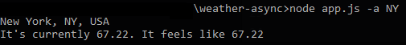
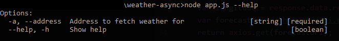

# Weather App - API Consumption
Get weather of any provided location. This API uses:
1. Google Geocode API - To get Latitude and Longitude
2. Forecast API - To get current weather from Geocode parames

## Getting started
Install dependencies
```
npm install
```

Run ´app.js´ using ´-a/--address´ flag with any location:

```
node app.js -a "SomeStreet #AnyNumber AnyCity..."
```

You should be getting something like this:  


## App API

